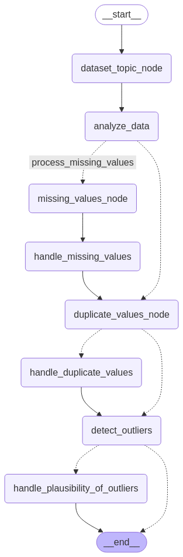

# ai-agents

## Overview

This project is a collection of AI agents that use natural language to interact with users.

## Features

1. Login with Auth0
2. Ollama server deployed on RunPod for LLM calls


## Installation

1. Clone the repository:
```bash
git clone {repository-url}
cd {repository-name}
```

2. Create and activate a virtual environment:
```bash
python -m venv env
source env/bin/activate  # On Windows: env\Scripts\activate
```

3. Install dependencies:
```bash
pip install -r requirements.txt
```

4. Run the application:
```bash
streamlit run app.py
```

# Data Cleaning AI Agent

The Data Cleaning AI Agent is a specialized workflow that automates the data cleaning process using LLMs. It analyzes datasets and performs multiple cleaning operations in sequence:

1. **Data Analysis**: Examines the dataset for issues requiring cleaning
2. **Missing Values**: Detects and handles missing values with appropriate strategies
3. **Duplicate Values**: Identifies and manages duplicate records based on contextual analysis
4. **Outlier Detection**: Finds and processes statistical outliers in the data

The agent uses a directed graph workflow powered by LangGraph to orchestrate these operations, making intelligent decisions at each step based on the dataset's characteristics.

## Data Cleaning AI Agent Graph



The graph above visualizes the workflow nodes and decision paths the agent follows when processing data.